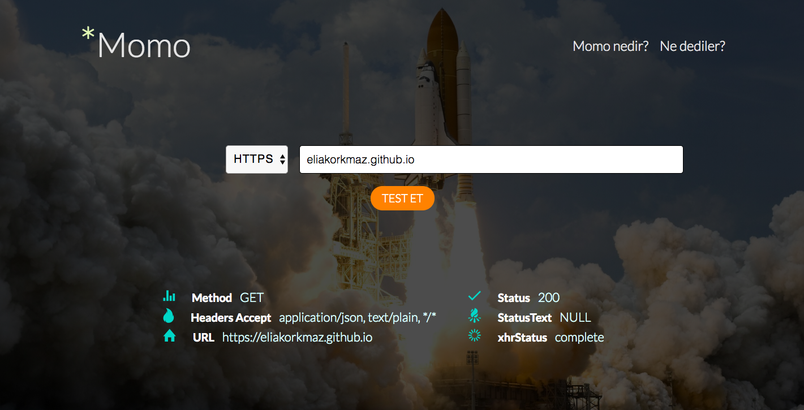

# Momo
Simple joy project to check a website's **availability** status



```
In momo, there've been used JavaScript & AngularJS and a bit jQuery.
```

### Run 

```bash
git clone repo_ssh_link
cd ~/Momo
index.html -> open with browser
```

### Live

[Momo Live](https://momostatus.herokuapp.com/)

### Background Works 


> Momo has started with **HTML** & **CSS** then implemented a simple **Angular MVVM** Controller with **vm** to bind between Model and View. When the page has CORS problem, the error've occured in some websites that decline Cross-Origin requests.


